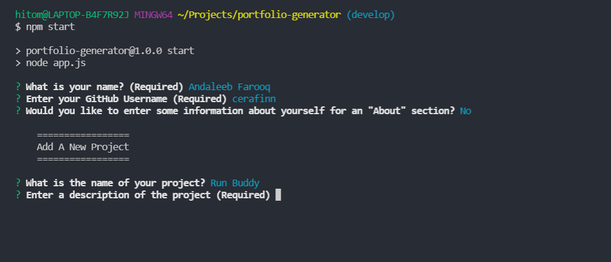

# Portfolio Generator

## Description
Node application that creates a portfolio based on user input.

Table of Contents |
-------------------|
[Installation](#Installation)
[Usage](#Usage)
[Technologies](#Technologies)
[Screenshots](#Screenshots)
[Contributing](#Contributing)
[Author](#Author)
[Questions](#Questions)

 

## Installation

In order to run the project locally, ensure that dependencies are installed by running:

`npm i` or `npm install`

 

## Usage

The Node application runs in the terminal. Users are required to enter either `node app` or `npm start` and the application begin running. The user will be prompted with questions. The prompts that require inputs have a validation option that prevent users from moving on without entering informaiton in the section. After entering the information, the Node application then generates an index.html in the dist folder.

You can find the deployed link and the repository link below:

Repo Link: [Repo Link](https://github.com/cerafinn/portfolio-generator)

 

## Technologies

* HTML
* CSS
* JavaScript
* Node
* Inquirer

 

## Screenshots

## Contributing

If interested in contributing to the project, feel free to reach out. Contact information can be found in the Questions section.

 

## Author

Andaleeb Farooq: [:octocat:](https://github.com/cerafinn)

 

## Questions

If you have any questions or issues, feel free to reach out at: andaleeb.farooq@gmail.com.
You can also find more of my work on Github at [github link](https://github.com/cerafinn).